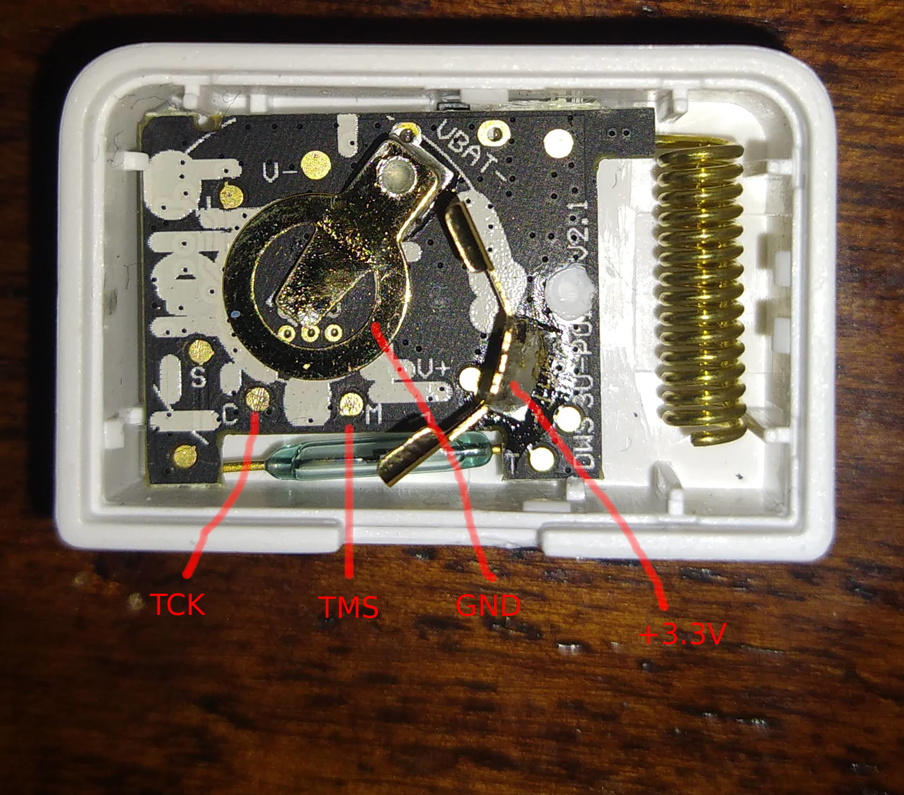

# wyzeback
---
wyzeback is a way to unbrick your Wyze Sense sensors. This is a hack. The script replaces the MAC in a working firmware dump with the MAC of the broken unit. You will need the CC1310 Launchpad to flash the chip.

## Tools / software needed
Uniflash - https://www.ti.com/tool/UNIFLASH

CC1310 Launch pad - https://www.ti.com/tool/LAUNCHXL-CC1310

## Pinout
C - TCK

M - TMS

GND - GND

+3.3V - +3.3V

## Steps
- Patch firmware with `wyzeback_door.py <new mac>`
-- or `bbe -e 's/AABBCCDD/DDCCBBAA/' wyzesense_door_AABBCCDD.bin > patched.bin`
- Hookup the CC1310 Launchpad as noted in the pinout, it is possible to hold the C and M pins by hand
- Flash with Uniflash (pick CC1310F128)
- If it won't flash, erase the flash and try again

## Notes  
- This only works for the door sensor for now. The same probably can be done with the motion sensor.
- The MAC must match the programmed MAC, it seems there firmware checks this against the MAC burned in CCFG.
